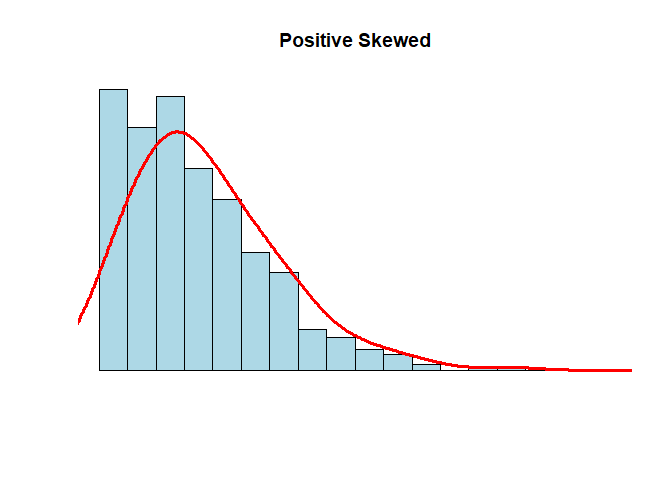

Atividade Avaliativa 1
================
Andrei Paraizo dos Santos </br>
Estatistica 2021.1

``` r
library(tidyverse)
```

    ## -- Attaching packages --------------------------------------- tidyverse 1.3.1 --

    ## v ggplot2 3.3.5     v purrr   0.3.4
    ## v tibble  3.1.6     v dplyr   1.0.7
    ## v tidyr   1.1.4     v stringr 1.4.0
    ## v readr   2.1.1     v forcats 0.5.1

    ## -- Conflicts ------------------------------------------ tidyverse_conflicts() --
    ## x dplyr::filter() masks stats::filter()
    ## x dplyr::lag()    masks stats::lag()

``` r
frango_dieta <- read_csv("dados/brutos/frango_dieta.csv")
```

    ## Rows: 578 Columns: 4

    ## -- Column specification --------------------------------------------------------
    ## Delimiter: ","
    ## dbl (4): peso, tempo, frango, dieta

    ## 
    ## i Use `spec()` to retrieve the full column specification for this data.
    ## i Specify the column types or set `show_col_types = FALSE` to quiet this message.

``` r
View(frango_dieta)

dados_co2 <- read_csv("dados/brutos/dados_co2.csv")
```

    ## Rows: 39 Columns: 13

    ## -- Column specification --------------------------------------------------------
    ## Delimiter: ","
    ## dbl (13): ano, jan, fev, mar, abr, mai, jun, jul, ago, set, out, nov, dez

    ## 
    ## i Use `spec()` to retrieve the full column specification for this data.
    ## i Specify the column types or set `show_col_types = FALSE` to quiet this message.

``` r
View(dados_co2)
```

**Questao 01** **a** O erro é que ele considera a mala mais pesada sendo
a que representa o valor do quartis superior e análise de análise que
pelo boxplot existem malas mais pesadas entre esse quartil e o limite
superior (29kg), onde está localizado 25% da amostra (malas). Portanto,
23kg não representa a mala mais pesada da distribuição.

**b** A mediana é representada pelo segundo quartil, assim, o seu valor
é de 17kg.

**c** A distância interquartílica é a diferença entre o quartil superior
pelo quartil inferior, assim, a distância seria 23 - 10 = 13.

**d** A quantidade de malas presente entre 5kg e 10kg está no primeiro
quartil que corresponde a 25% do total da amostra, assim, corresponderia
a 25% de 240 malas, ou seja, 60 malas.

**Questao 2** Obtive a soma de todas as médias dos 30 alunos,
multiplicando 30 pela média aritmética das notas, ou seja, 6.40
encontrando como resultado 192. Da mesma forma, obtive a soma total das
médias dos outros 50 alunos da outra turma, multiplicando o total de
alunos (50) por 5,20 tendo como total 260. Feito isso, somei a soma
total das médias das duas turma (192 + 260 = 452) e dividi por 80 (total
de alunos correspondentes as duas turmas) (452/80) . Assim, obtive que a
média aritmética dos 80 alunos é 5.65. Alternativa A.

**Questao 3**

``` r
X  <- c ( 68 , 70 , 72 , 58 , 90 , 110 , 68 , 70 , 72 , 80 , 80 , 67 , 90 , 94 , 100 , 80 , 75 , 79 , 84 , 90 )
(110:58)
```

    ##  [1] 110 109 108 107 106 105 104 103 102 101 100  99  98  97  96  95  94  93  92
    ## [20]  91  90  89  88  87  86  85  84  83  82  81  80  79  78  77  76  75  74  73
    ## [39]  72  71  70  69  68  67  66  65  64  63  62  61  60  59  58

**b** Média = 79,85; Primeiro quartil = 70,0; Mediana = 79,5; Quartil
Terceiro = 90; Desvio padrão = 12.78681

Para encontrar essa resposta, utilizei os seguintes códigos

``` r
mean ( X )
```

    ## [1] 79.85

``` r
quantile ( X )
```

    ##    0%   25%   50%   75%  100% 
    ##  58.0  70.0  79.5  90.0 110.0

``` r
median ( X )
```

    ## [1] 79.5

``` r
sd ( X )
```

    ## [1] 12.78681

**c** No histograma, é possível perceber uma certa assimetria entre os
valores, por isso, acredito que a mediana representa a melhor medida
central do conjunto de dados.

**Questao 4** **a**

Ao analisar o conjunto de dados foi possível identificar que cada coluna
representa uma variável (peso, tempo, frango, dieta), cada linha
apresentava sobre as variáveis e cada célula apresentava uma única
observação, logo, este dataset está organizado na forma tidy

**b** Usando o codigo

``` r
mean(frango_dieta $ peso)
```

    ## [1] 121.8183

Encontrei que a média do peso dos fragos é 121.8183.

**c** Usando o código

``` r
sd( frango_dieta $ peso )
```

    ## [1] 71.07196

Encontrei como desvio padrão o valor 71.07196

**d** A variável peso é quantitativa contínua. A variável tempo é
quantitativa discreta A variável é frango qualitativa nominal A variável
dieta é qualitativa nominal

**Questao 5**

``` r
#---------------------------------------------------------
N <- 1000
x <- rnbinom(N, 4, .5)
hist(
x,
xlim = c(min(x), max(x)),
probability = T,
nclass = max(x) - min(x) + 1,
col = 'lightblue', xlab = ' ', ylab = ' ', axes = F,
main = 'Positive Skewed'
)
lines(density(x, bw = 1), col = 'red', lwd = 3)
```

<!-- -->

``` r
#---------------------------------------------------------
```

Analisando esse gráfico, é possível perceber que a disposição dos
valores é assimétrica, logo, a mediana é a melhor medida central para
representar esses dados.

**Questao 6** **a**
